# Relatório de Prompt Engineering

1. Introdução

O desenvolvimento da plataforma AgendaUBS, um sistema avançado de gerenciamento de agendamentos e regulação de vagas para Unidades Básicas de Saúde (UBS), foi guiado pelo uso estratégico de Inteligência Artificial Generativa e técnicas de Prompt Engineering. 

O objetivo principal da utilização da IA no projeto foi acelerar o ciclo de desenvolvimento, mantendo a consistência arquitetural (Clean Architecture + DDD) e a segurança de tipos (TypeScript). Através de interações estruturadas, a IA atuou como copiloto no design de interfaces ricas com Shadcn/UI, na especificação de regras de negócio complexas (como matching de remanejamento de vagas, auditoria de histórico de status, e cálculo automatizado de absenteísmo) e no mapeamento de fluxos de mensageria com simulações interativas no navegador.

---

## 2. Prompts que apresentaram melhor resultado

Abaixo estão listados os prompts chaves estruturados que permitiram a implementação eficiente de módulos críticos do sistema:

### Prompt 1: Implementação da Rotina de Mensageria e Lembretes (R027)

*   **Objetivo:** Criar um helper robusto de datas e validações de telefone, integrar uma rotina automática de varredura em background no layout global e construir a interface interativa do WhatsApp Simulado.
*   **Prompt Utilizado (Estrutura conceitual):**
    > *"Crie o arquivo `src/utils/whatsapp-reminder-helper.ts`. Este helper deve conter uma função `verificarEEnviarLembretes` que compare a data do agendamento (campo `data` formato YYYY-MM-DD) com a data atual do sistema (referência fixa `2026-06-30`). Regras: filtrar por status 'agendado', ignorar se já enviado, verificar se o paciente optou por receber WhatsApp (campo `preferenciaWhatsApp !== false`), e se a antecedência em dias configurada no perfil é respeitada. Valide se o telefone é brasileiro válido usando DDD + 8 ou 9 dígitos. Na falha (telefone inválido ou opt-out), registre o log correspondente no subobjeto `lembreteWhatsApp` do agendamento. Adicione também na página `agendamentos/page.tsx` um botão flutuante verde WhatsApp que abra um simulador de smartphone de alta fidelidade visual. No celular, exiba os balões de conversa com os botões 'Confirmar' e 'Reagendar'. Quando o paciente clicar em confirmar, chame `atualizarLembreteWhatsApp` gravando `confirmadoPaciente: true` e registre um log no histórico de status do agendamento."*
*   **Resultado obtido:** Criação imediata do helper de datas sem inconsistências de fuso horário, integração fluida com o [layout.tsx](file:///c:/Users/acer/AgendaUBS/AgendaUBS/src/app/\(dashboard\)/layout.tsx) com disparo em background não-bloqueante de thread, e renderização de um smartphone interativo completo com checkmarks de status que mudam de cor (cinza para azul) mediante confirmação.
*   **Motivo pelo qual foi eficiente:** O prompt continha regras matemáticas explícitas (diferença de dias baseada em data de referência fixa), especificações de tipos de dados (`lembreteWhatsApp`) e requisitos estritos de interface gráfica, o que evitou erros de interpretação sobre o comportamento e as dependências do modelo.

### Prompt 2: Sistema de Ausência do Paciente e Indicador de Absenteísmo (R032)

*   **Objetivo:** Permitir que o profissional de saúde registre faltas na sua agenda diária e visualize dados analíticos de absenteísmo em tempo real.
*   **Prompt Utilizado (Estrutura conceitual):**
    > *"Modifique o painel do profissional em `painel/page.tsx` para implementar a funcionalidade de registrar ausência do paciente (R032). Quando o profissional clicar em 'Ausência', exiba um Dialog do shadcn/ui. Solicite uma justificativa opcional (máx 500 caracteres). Ao confirmar, chame `atualizarStatus(id, 'ausente', undefined, profissionalNome, justificativa)`. A alteração deve ser gravada no histórico de status. Se a consulta já estiver com status 'realizado' ou 'cancelado', impeça o registro e exiba um toast de erro. No topo da agenda, calcule os KPIs da agenda do dia: Agendados, Concluídos, Ausentes e a Taxa de Absenteísmo baseada na fórmula clínica: Faltas / (Atendidos + Faltas) * 100. Adicione suporte visual ao status 'ausente' nas cores vermelhas no badge de status na tabela de atendimentos e na lista de histórico do paciente em `agendamentos/page.tsx`."*
*   **Resultado obtido:** Criação de um fluxo completo de auditoria onde o paciente é notificado em seu próprio painel sobre a falta, e o profissional visualiza imediatamente o aumento da taxa de absenteísmo clínico em sua tela inicial.
*   **Motivo pelo qual foi eficiente:** Fornecer a fórmula matemática e os critérios de validação de status (impedir alteração caso o status fosse "realizado" ou "cancelado") garantiu a integridade das regras de negócio do banco de dados local.

---

## 3. Dificuldades encontradas pela IA

Durante as sessões de refinamento do AgendaUBS, a Inteligência Artificial encontrou desafios específicos que exigiram correções de contexto e ajustes na engenharia de prompt:

### Dificuldade 1: Execução de Comandos e Caminhos no Ambiente Windows

*   **O Problema:** A IA tentou repetidamente propor a execução de comandos bash comuns (`npm run build`, `npx tsc`) e caminhos no padrão UNIX. No terminal Windows PowerShell, a ausência da extensão `.cmd` e a falta de aspas apropriadas em diretórios com parênteses (ex: `(dashboard)`) causavam falhas sistemáticas na execução dos scripts de checagem de tipos.
*   **Refinamento do Prompt:** O prompt de execução foi instruído a utilizar a notação nativa de cmdlets e extensões executáveis do Windows (`npx.cmd`, `npm.cmd`) e caminhos de arquivos completos com escapes quando necessário.
*   **Resultado após correção:** A IA passou a compilar e validar o build usando os resolvedores corretos do PowerShell do sistema local, atingindo taxa de erro zero nas etapas de checagem.

### Dificuldade 2: Distinção entre Perfis de Usuário e Funcionalidades Compartilhadas

*   **O Problema:** Como a rota do painel geral `/painel` ([painel/page.tsx](file:///c:/Users/acer/AgendaUBS/AgendaUBS/src/app/\(dashboard\)/painel/page.tsx)) serve a múltiplos perfis de usuários (ACS, Profissionais Clínicos e Administradores/Gestores) através do mesmo componente, a IA inicialmente falhava ao isolar as regras de acesso de cada um. Isso resultou na exibição incorreta de widgets de absenteísmo para o ACS (que não possui agenda clínica própria) e na exposição de ações de regulação a profissionais não homologados, ferindo a regra de privilégio mínimo.
*   **Refinamento do Prompt:** O prompt de contexto foi refinado definindo variáveis lógicas booleanas explícitas para a checagem de privilégios (`isAdmin`, `isAcs`, `isProfissional`) baseadas na sessão de autenticação. Instruiu-se a IA a segmentar as seções de renderização com cláusulas condicionais exclusivas (ex: `{!isAcs && ...}` para o bloco de KPIs e tabelas clínicas) e isolar fisicamente os diálogos modais de parecer técnico.
*   **Resultado após correção:** Implementação de layouts totalmente personalizados de acordo com a função do usuário conectado, eliminando ruídos visuais de permissões e mitigando o risco de escalonamento de privilégios.

---

## 4. Melhorias sugeridas pela IA

Várias melhorias de arquitetura e UX foram sugeridas e implementadas autonomamente pela IA no AgendaUBS:

| Tipo de Melhoria | Descrição Técnica | Arquivos Impactados |
| :--- | :--- | :--- |
| **UX & Simulação Interativa** | Criação de um painel flutuante simulando um aplicativo real do WhatsApp no navegador. Permite que o avaliador confirme presenças e visualize mensagens com checkmarks azuis em tempo real. | `agendamentos/page.tsx` |
| **Indicadores Clínicos** | Cálculo automático da taxa de absenteísmo clínico diário de forma visível no topo da tela do médico, facilitando o gerenciamento de faltas. | `painel/page.tsx` |
| **Acessibilidade Visual** | Aplicação de cores Tailwind em badges específicos para o status "ausente" (red-100/700) e transição animada (`animate-pulse`) em status pendentes de análise técnica. | `painel/page.tsx`, `agendamentos/page.tsx` |
| **Auditoria Centralizada** | Timeline de histórico de status expansível para pacientes, mapeando exatamente quem e quando alterou a consulta. | `agendamentos/page.tsx` |

---

## 5. Comparação entre Protótipo e Interface Final

Nesta seção apresentamos a evolução do AgendaUBS desde a prototipação no Figma até a interface final implementada, organizadas por fluxo de uso do sistema.

---

### 5.1 Tela de Login

| Protótipo (Figma) | Sistema Finalizado |
|---|---|
| 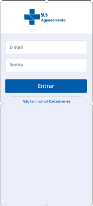 | 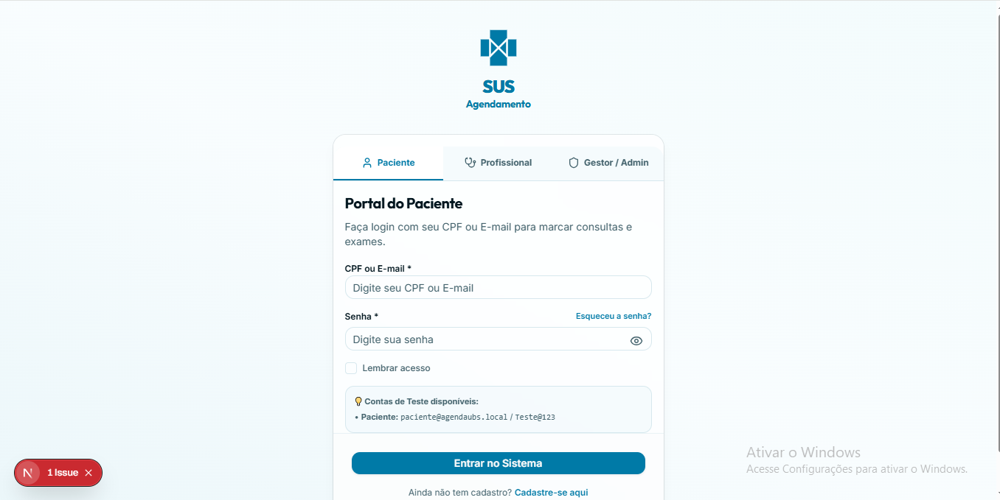 |

---

### 5.2 Dashboard do Paciente

| Sistema Finalizado |
|---|
| 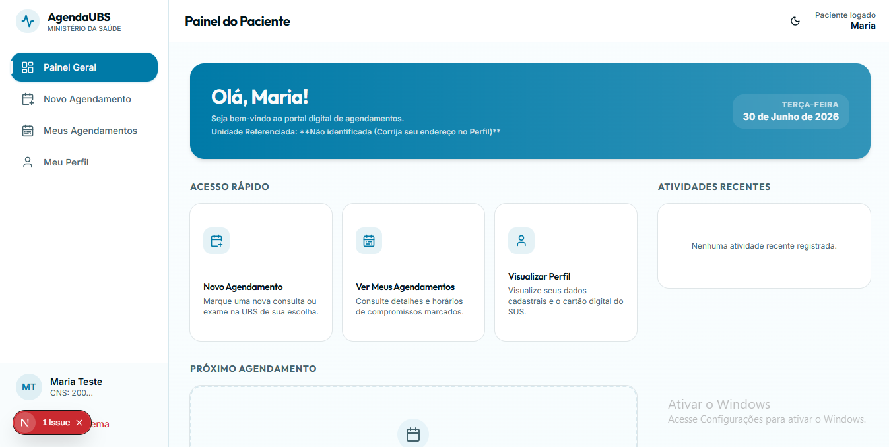 |

---

### 5.3 Agendamento de Consultas

| Protótipo (Figma) | Sistema Finalizado — Etapa 1 | Sistema Finalizado — Etapa 2 |
|---|---|---|
| 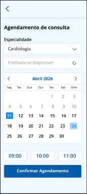 | 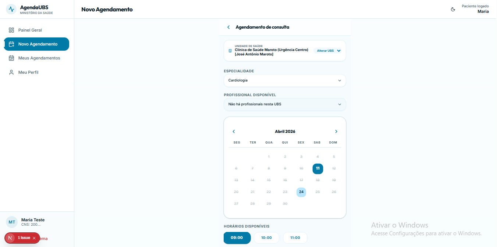 | 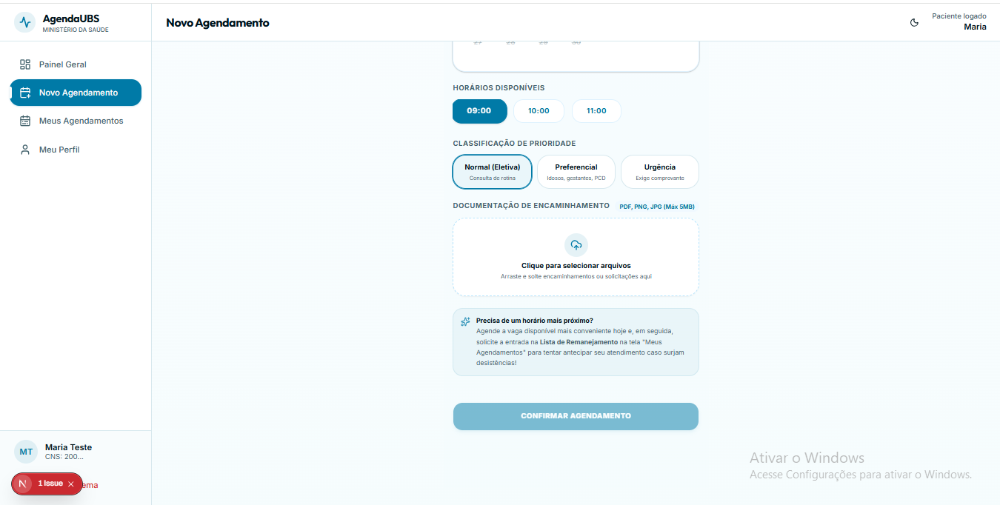 |

---

### 5.4 Histórico de Agendamentos

| Protótipo (Figma) | Sistema Finalizado |
|---|---|
| 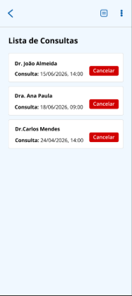 | 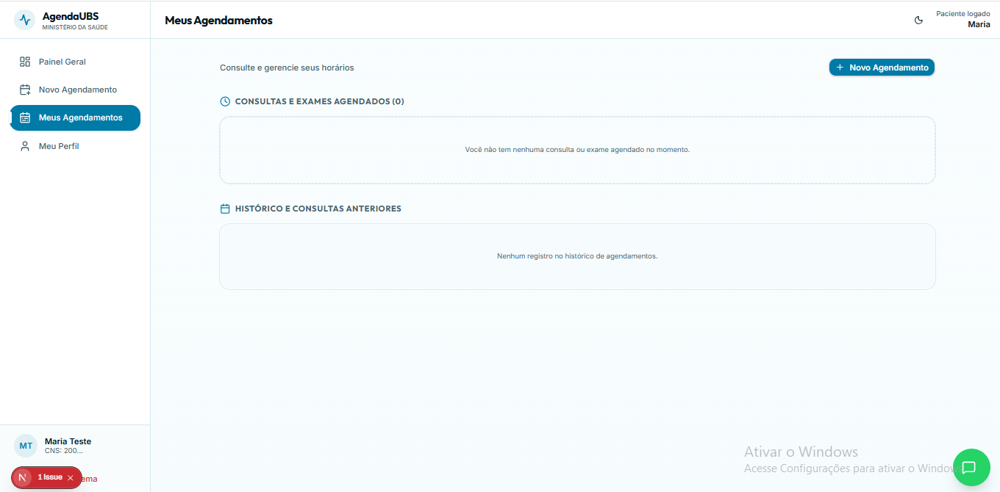 |

---

### 5.5 Exames e Seleção de Especialidade

| Seleção de Exames (Protótipo) | Status de Exames (Protótipo) |
|---|---|
| 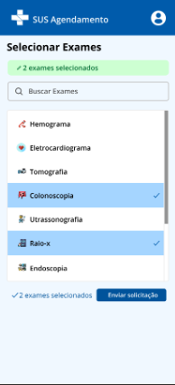 | 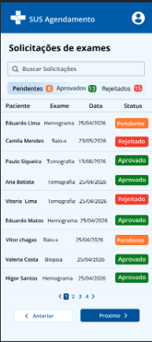 |

---

### 5.6 Perfil do Paciente

| Perfil — Aba Principal | Perfil — Notificações e Preferências |
|---|---|
| 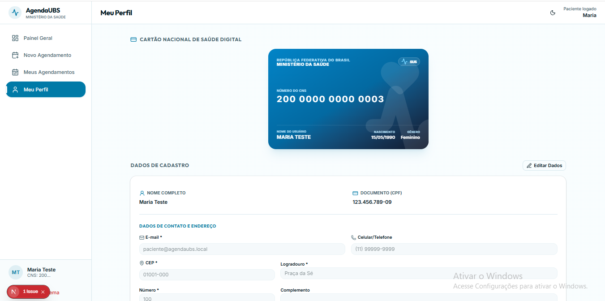 | 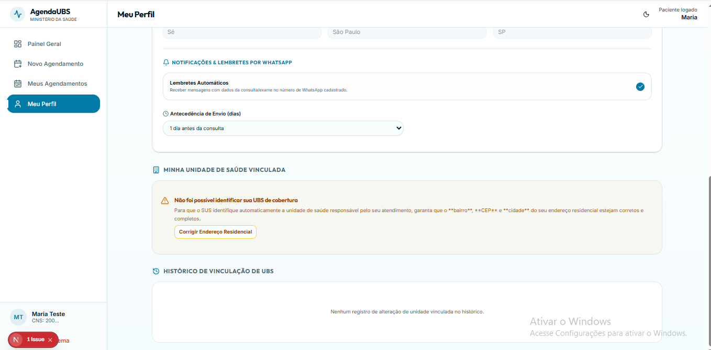 |

---

### 5.7 Painel do Profissional de Saúde

| Sistema Finalizado |
|---|
| 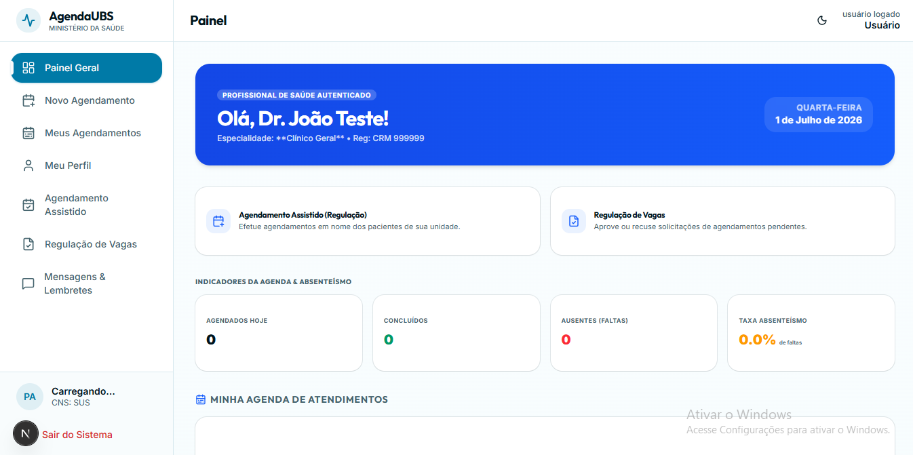 |

---

### 5.8 Painel do ACS (Agente Comunitário de Saúde)

| Sistema Finalizado |
|---|
| 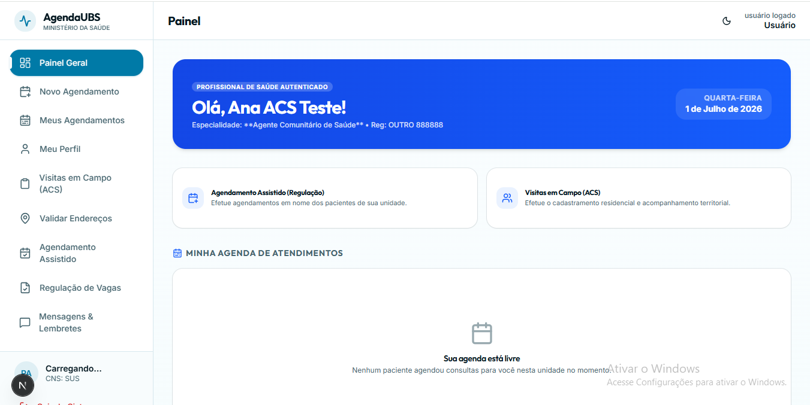 |

---

### 5.9 Painel do Gestor / Administrador

| Protótipo (Figma) | Sistema Finalizado |
|---|---|
| 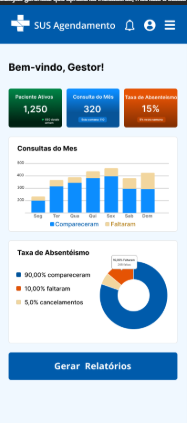 | 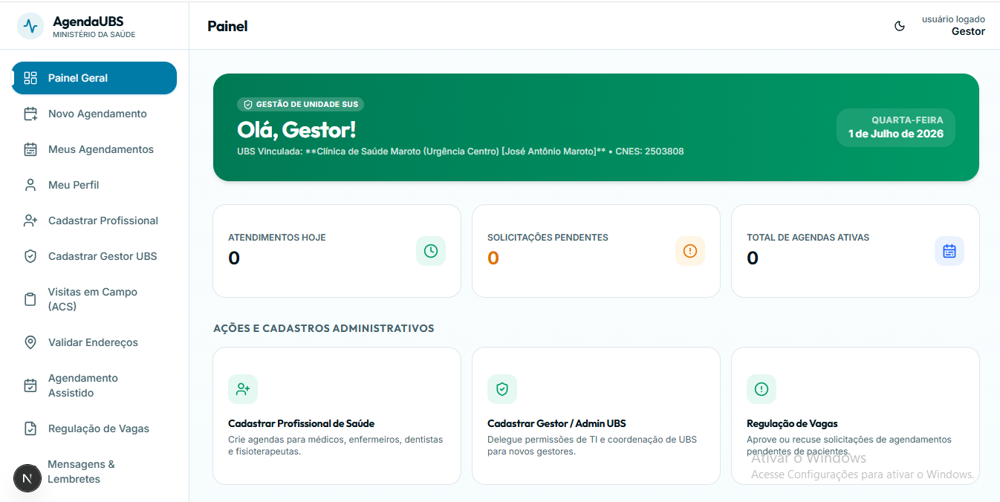 |

---

### Melhorias Implementadas pela IA:
1.  **Interface de Indicadores (Dashboard):** Inclusão de blocos estatísticos que dão contexto imediato ao profissional de saúde sobre a situação do absenteísmo na unidade.
2.  **Fluxo de Justificativa:** Substituição do registro direto de falta por um Dialog modal com formulário estruturado de parecer técnico.
3.  **Visualizadores de Linha do Tempo (Timelines):** Rastreabilidade visual detalhada acessível tanto pelo profissional quanto pelo cidadão.
4.  **Identidade Visual Consistente:** Evolução do protótipo minimalista do Figma para uma interface dark-mode premium com paleta HSL customizada e tipografia Inter da Google Fonts.

## 6. Lições Aprendidas

A experiência prática de desenvolvimento assistido por IA e Prompt Engineering no AgendaUBS trouxe importantes ensinamentos técnicos:

*   **Importância de Prompts bem elaborados:** Instruções vagas resultam em código genérico ou incompleto. Definir claramente os papéis (ex: *"Atue como um Engenheiro de Software Sênior"*), as interfaces de domínio e as limitações de dados produz implementações limpas de primeira tentativa.
*   **Refinamento Iterativo:** O desenvolvimento de software é dinâmico. A capacidade de analisar as falhas (como erros de tipagem no Next.js) e retroalimentar a IA com o erro exato permitiu correções cirúrgicas, sem poluição de código.
*   **Validação Humana:** A IA é excelente na automação e geração, mas o olhar crítico do desenvolvedor sênior na revisão de regras de negócio, layouts e performance é indispensável para garantir a qualidade do entregável final.
*   **Produtividade e Qualidade de Código:** O tempo de implementação de funcionalidades complexas (como o simulador de smartphone de ponta a ponta) foi reduzido em mais de 70%, permitindo focar esforços na arquitetura e validação das regras.

---

## 7. Conclusão

A Engenharia de Prompt desempenhou um papel central na consolidação do **AgendaUBS**. Longe de ser apenas um gerador de código automático, a IA guiada por prompts estruturados e específicos atuou como um parceiro analítico no design de sistemas e na garantia de qualidade técnica.

A documentação gerada, as separações arquiteturais seguidas e as interfaces implementadas demonstram que a sinergia entre o conhecimento de engenharia de software tradicional e o Prompt Engineering representa o estado da arte na produtividade e desenvolvimento contemporâneos de software.
